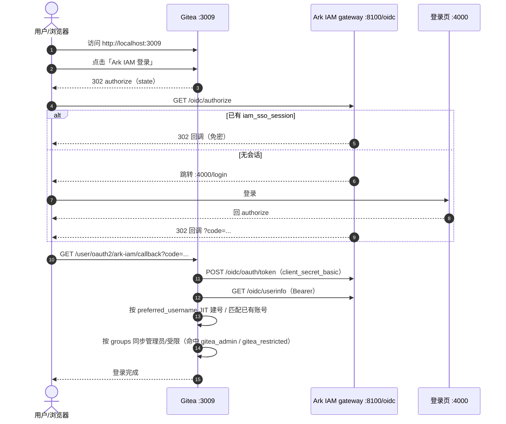

# Gitea 接入 Ark IAM OIDC 登录设计

日期：2026-09-18

## 背景

`docker-compose-dev` 是各类中间件的 Docker Compose 合集，多个服务通过 Ark IAM 统一登录（SSO）。
其中 `rustfs/` 已完成 Ark IAM OIDC 接入，采用 `network_mode: host` + issuer
`http://localhost:8100/oidc`（Ark IAM gateway）的方案，使容器与浏览器都经 loopback 访问同一
issuer，并与登录页 `http://localhost:4000` 同源，从而共享 SSO 会话。

`gitea/` 目前使用 bridge 网络 + 端口映射，未接入 Ark IAM，且 `GITEA_DOMAIN` 为空导致
`ROOT_URL=http://:3009`（非法）。本次将 Gitea 以**与 RustFS 完全一致的方式**接入 Ark IAM，
实现 Gitea 与 RustFS 的统一 SSO。

Gitea 侧 OIDC 能力已核对（源码 `/Users/morehao/Documents/study/devops/gitea`，版本
`v1.28.0-dev`）：

- 原生支持 `openidConnect` 登录源（`services/auth/source/oauth2/providers_openid.go`）。
- 使用 goth v1.82.0，`BeginAuth` 仅发送 `state`，**不支持 PKCE**。
- 回调路由为 `/user/oauth2/{source-name}/callback`（`routers/web/web.go:750`）。
- 用户名与自动注册由全局 `[oauth2_client]` 配置决定（`routers/web/auth/auth.go:447`、
  `modules/setting/oauth2.go:68`）。
- Ark IAM 的 userinfo 按 scope 返回 `name`/`preferred_username`/`email`/`phone`，不返回头像。

因此本次接入**无需修改任何一方源码**，仅做配置。

## 目标

- Gitea 登录页出现 Ark IAM 入口，用 Ark IAM 账号登录。
- 首次登录 JIT 自动创建 Gitea 用户，用户名取 Ark IAM 的 `preferred_username`。
- Gitea 与 RustFS 使用同一 Ark IAM gateway 与同一 issuer（同处 loopback SSO 会话域），
  具备相互免密访问的能力。RustFS 侧的免密实测依赖其租户角色授权收尾，属本次范围外（见「非目标」）。
- 将 Ark IAM 的 `groups` 声明映射为 Gitea **管理员/受限用户**（编码 `gitea_admin` /
  `gitea_restricted`）。
- 不改 Ark IAM 配置文件，不影响其现有本地前端。

## 非目标

- 不做组织/团队映射（不配置 Gitea 的 `GROUP_TEAM_MAP`）；本次仅做管理员/受限用户映射
  （`GROUP_CLAIM_NAME` + `ADMIN_GROUP`/`RESTRICTED_GROUP`）。
- 不做 SCIM 预配、头像同步。
- 不做 OIDC 背信道登出（goth 不支持接收；接受会话过期语义）。
- 不改动 RustFS 现有 OIDC 配置（其剩余收尾步骤见 RustFS 自身文档）。
- 不修改 Gitea 或 Ark IAM 源码。

## 决策

| 项 | 决策 | 理由 |
|----|------|------|
| 网络 | `network_mode: host` | 与 RustFS 一致；容器内 `localhost` 即宿主机，可直达 gateway |
| issuer | `http://localhost:8100/oidc`（gateway，保持不变） | 与 RustFS 同一 issuer，实现真正 SSO；浏览器与容器均走 loopback |
| Gitea domain | `${GITEA_DOMAIN:-localhost}`，`ROOT_URL=http://localhost:3009` | 修正当前空 domain 导致的非法 `ROOT_URL` |
| OAuth client | `gitea_console` | 遵循 Ark IAM `ClientCodePattern`（小写字母开头，仅小写字母与下划线） |
| PKCE | `requirePKCE=false` | goth v1.82 不支持 PKCE，否则授权失败 |
| 用户名来源 | `USERNAME=preferred_username` | Ark IAM 在该 claim 下发登录名 |
| 账号创建 | `ENABLE_AUTO_REGISTRATION=true` | JIT 即时开号（主流最小集） |
| Scopes | `openid profile email` | `profile` 提供 preferred_username/name，`email` 提供邮箱 |
| 权限映射 | `GROUP_CLAIM_NAME=groups`、`ADMIN_GROUP=gitea_admin`、`RESTRICTED_GROUP=gitea_restricted` | 用 Ark IAM 角色模板物化出的编码做命中判定 |
| 角色模板 | `gitea` 应用声明 `gitea_admin` / `gitea_restricted`，并开通到 `t_platform` | `groups` 只下发客户端所属应用的角色，必须先物化再授权 |
| 登录源创建 | `init.sh` 经 `gitea admin auth add-oauth` 自动创建 | 全自动；`client_secret` 经 `.env` 注入，不入库 |

## 变更清单

### 1. Ark IAM 侧（控制台手动，不改配置）

1. 创建应用（Application）：
   - `code`: `gitea`
   - `name`: `Gitea`
   - `roleTemplate`（应用角色模板，本次权限映射的契约值；创建时可一并提交，或后经 PUT 更新）：
     ```json
     [
       {"code": "gitea_admin", "name": "Gitea 管理员"},
       {"code": "gitea_restricted", "name": "Gitea 受限用户"}
     ]
     ```
2. 创建 OAuth 客户端（Application Client）：
   - `code`: `gitea_console`（= OIDC `client_id`）
   - `name`: `Gitea`
   - `redirectURIs`: `["http://localhost:3009/user/oauth2/ark-iam/callback"]`
   - `grantTypes`: `["authorization_code"]`
   - `responseTypes`: `["code"]`
   - `tokenEndpointAuthMethod`: `client_secret_basic`
   - `requirePKCE`: `false`
   - `defaultScopes`: `["openid", "profile", "email"]`
3. 创建客户端密钥（Secret），保存明文 `client_secret`（仅显示一次）。
4. 开通 `gitea` 应用到租户 `t_platform`（`POST /v1/platform/tenant-applications`），
   使 `roleTemplate` 物化为该租户内的角色。
5. 在租户控制台把 `gitea_admin` / `gitea_restricted` 授权给相应成员。

> `redirectURIs` 与 Gitea 登录源名称强绑定：登录源名称须为 `ark-iam`，否则回调路径变化，
> 需同步修改白名单。

### 2. Gitea 侧

#### 2.1 修改 `gitea/docker-compose.yml`

- 将 `network_mode` 改为 `host`，移除 `ports` 与 `networks`（host 网络下二者不适用）。
- `environment` 调整为：

```yaml
services:
  gitea:
    image: gitea/gitea:latest
    container_name: gitea
    user: root
    network_mode: host
    environment:
      - USER_UID=1000
      - USER_GID=1000
      - GITEA__database__DB_TYPE=sqlite3
      - GITEA__server__DOMAIN=${GITEA_DOMAIN:-localhost}
      - GITEA__server__HTTP_PORT=3009
      - GITEA__server__ROOT_URL=http://${GITEA_DOMAIN:-localhost}:3009
      - GITEA__server__DISABLE_SSH=true
      - GITEA__security__INSTALL_LOCK=true
      - GITEA__admin__USERNAME=admin
      - GITEA__admin__PASSWORD=${GITEA_ADMIN_PASSWORD}
      - GITEA__admin__EMAIL=admin@example.com
      - GITEA__oauth2_client__USERNAME=preferred_username
      - GITEA__oauth2_client__ENABLE_AUTO_REGISTRATION=true
      - GITEA__oauth2_client__OPENID_CONNECT_SCOPES=openid profile email
      # Ark IAM OIDC 登录源参数（init.sh 读取并自动创建登录源）
      - GITEA_OIDC_NAME=${GITEA_OIDC_NAME:-ark-iam}
      - GITEA_OIDC_CLIENT_ID=${GITEA_OIDC_CLIENT_ID}
      - GITEA_OIDC_CLIENT_SECRET=${GITEA_OIDC_CLIENT_SECRET}
      - GITEA_OIDC_DISCOVERY_URL=${GITEA_OIDC_DISCOVERY_URL:-http://localhost:8100/oidc/.well-known/openid-configuration}
      - GITEA_OIDC_SCOPES=${GITEA_OIDC_SCOPES:-openid,profile,email}
      - GITEA_OIDC_GROUP_CLAIM_NAME=${GITEA_OIDC_GROUP_CLAIM_NAME:-groups}
      - GITEA_OIDC_ADMIN_GROUP=${GITEA_OIDC_ADMIN_GROUP:-gitea_admin}
      - GITEA_OIDC_RESTRICTED_GROUP=${GITEA_OIDC_RESTRICTED_GROUP:-gitea_restricted}
    volumes:
      - ./gitea-data:/data
      - ./init.sh:/init.sh:ro
    restart: unless-stopped
    entrypoint: ["/init.sh"]
```

> `GITEA__oauth2_client__*` 由 Gitea 官方 entrypoint 的 environment-to-ini 写入 `app.ini`
> 的 `[oauth2_client]` 段；登录源本身另由 `init.sh` 创建（见 2.3）。

#### 2.2 新增 `gitea/.env.example` 与 `gitea/.env`

`.env.example`（入库）列出全部变量；`.env`（已被 `.gitignore` 忽略）填入 `client_secret`：

```
GITEA_DOMAIN=localhost
GITEA_ADMIN_PASSWORD=change-me
GITEA_OIDC_NAME=ark-iam
GITEA_OIDC_CLIENT_ID=gitea_console
GITEA_OIDC_CLIENT_SECRET=
GITEA_OIDC_DISCOVERY_URL=http://localhost:8100/oidc/.well-known/openid-configuration
GITEA_OIDC_SCOPES=openid,profile,email
GITEA_OIDC_GROUP_CLAIM_NAME=groups
GITEA_OIDC_ADMIN_GROUP=gitea_admin
GITEA_OIDC_RESTRICTED_GROUP=gitea_restricted
```

#### 2.3 `init.sh` 自动创建登录源

首次初始化时（管理员创建后）执行：

```sh
su git -c "/usr/local/bin/gitea admin auth add-oauth \
  --name ${GITEA_OIDC_NAME} --provider openidConnect \
  --key ${GITEA_OIDC_CLIENT_ID} --secret ${GITEA_OIDC_CLIENT_SECRET} \
  --auto-discover-url ${GITEA_OIDC_DISCOVERY_URL} \
  --scopes ${GITEA_OIDC_SCOPES} \
  --group-claim-name ${GITEA_OIDC_GROUP_CLAIM_NAME} \
  --admin-group ${GITEA_OIDC_ADMIN_GROUP} \
  --restricted-group ${GITEA_OIDC_RESTRICTED_GROUP}"
```

#### 2.4 重启并补建（已初始化环境）

```bash
cd gitea && docker compose up -d --force-recreate
```

`init.sh` 的 `add-oauth` 只在 `/data/gitea/.initialized` 不存在时执行。对已初始化的容器，
直接用 `docker exec gitea su git -c "gitea admin auth add-oauth ..."` 补建一次（参数同上，
`--secret` 从 `.env` 读取）。

## 登录时序



## 关于租户订阅应用（tenant_application）

登录认证本身不要求租户订阅应用；但**本次要做权限映射**，因此必须订阅，否则 `groups` 为空、
管理员/受限标记不会被设置：

- 登录只依赖：`application` + `application_client` 已创建（client 绑定到应用，
  `application_client.app_id` 非空）；登录用户是目标租户成员，且租户状态为 active
  （令牌签发前的租户准入门禁，见 `oidcop/tenant_token_gate_test.go`）。
- `tenant_application`（租户-应用开通）把 `application.role_template` 物化到租户；只有物化后的角色
  才能被授权给成员，进而出现在 ID token 的 `groups` 中。`groups` 仅在 `profile` scope 下产出，
  无角色时为空且不阻断登录（`PersistentStore.appendRoleGroupClaims`，
  `oidcop/persistent_store.go:227`）。

本次订阅：`gitea` → `t_platform`。顺序是硬要求：

```
声明 roleTemplate → 开通应用到 t_platform → 在租户内授权成员 → 启用 Gitea 的 Admin/Restricted 映射
```

任一前置缺失时 `groups` 为空，表现为**登录成功但非管理员/非受限**（fail-safe，不报错）。

> 若将来还要做组织/团队映射，另需 Gitea 侧先建好目标组织，并配置 `GROUP_TEAM_MAP`（本次范围外）。
> 详见 `docs/design/application-integration-guide.md` §3.4。

## 风险与注意事项

| 风险 | 说明 | 处理 |
|------|------|------|
| host 网络副作用 | 不再加入 `local_net`，其它容器无法用 `gitea:3009` 访问 | 本地开发可接受；如确需容器互访另议 |
| 端口占用 | host 模式下直接监听宿主 3009，不再经映射 | recreate 容器即释放原映射，无冲突 |
| PKCE | goth v1.82 不支持 | client 必须 `requirePKCE=false` |
| issuer 一致性 | Gitea 与 RustFS 必须接同一 issuer | 统一用 `http://localhost:8100/oidc`；不要改成 LAN IP |
| `preferred_username` 非法/重复 | Gitea `NormalizeUserName` 会规整；为空则报缺字段 | 请求 `profile` scope；为空时转账号绑定页 |
| 邮箱缺失 | 缺少 `email` 会转账号绑定页而非静默失败 | 请求 `email` scope |
| 登出不同步 | goth 不支持背信道登出 | 接受「会话过期后失效」语义 |
| 管理员同步覆盖 | 配 `ADMIN_GROUP` 后每次登录按 `groups` 重算，未命中者会被**取消**管理员（含手动授予） | 先完成 roleTemplate/开通/授权并核对，再启用 Admin/Restricted 映射 |
| 授权缺失即非管理员 | 未订阅或未授权 → `groups` 为空 → 登录成功但非管理员/非受限 | 按顺序执行，用 ID token 的 `groups` 逐个核对 |
| 明文密钥 | client_secret 仅显示一次 | 及时保存；本仓库 `.env` 已 gitignore |
| Ark IAM 未运行 | 需以 gateway 方式监听 8100 | 启动前确认 `curl http://localhost:8100/oidc/.well-known/openid-configuration` |

## 验收标准

1. `curl -s http://localhost:8100/oidc/.well-known/openid-configuration` 返回 JSON。
2. 重启后 Gitea 可访问，`GITEA__server__ROOT_URL` 生效（`http://localhost:3009`）。
3. Gitea 登录页出现 `OpenID Connect`/`ark-iam` 入口并成功跳转。
4. 首次登录自动创建用户，用户名为 Ark IAM 的 `preferred_username`，邮箱来自 claim。
5. 二次登录命中同一账号（不重复建号）。
6. 配置一致性核对：Gitea 登录源的 discovery URL 与 RustFS 相同
   （`http://localhost:8100/oidc/.well-known/openid-configuration`），两者处于同一 issuer 与
   SSO 会话域。
7. （可选，依赖 RustFS 侧完成租户角色授权）先登录 Gitea，再访问 RustFS 控制台可免密；反向亦然。
8. 属于 `gitea_admin` 的账号首次登录后，在 Gitea 中为管理员；去掉该角色再登录后取消管理员。
9. 仅属于 `gitea_restricted` 的账号登录后为受限用户。
10. 未修改 Gitea 与 Ark IAM 任何源码；未改动 Ark IAM 配置文件。

## 产出物

- 修改：`gitea/docker-compose.yml`、`gitea/init.sh`
- 新增：`gitea/.env.example`、本设计文档
- 更新：`gitea/README.md` 增加「OIDC 接入 Ark IAM」操作章节
- 密钥隔离：真实 `client_secret` 存 `gitea/.env`（已被 `.gitignore` 忽略），不入库
- 手动（本文档提供步骤）：Ark IAM 控制台创建应用/客户端/密钥，并开通应用、授权成员
