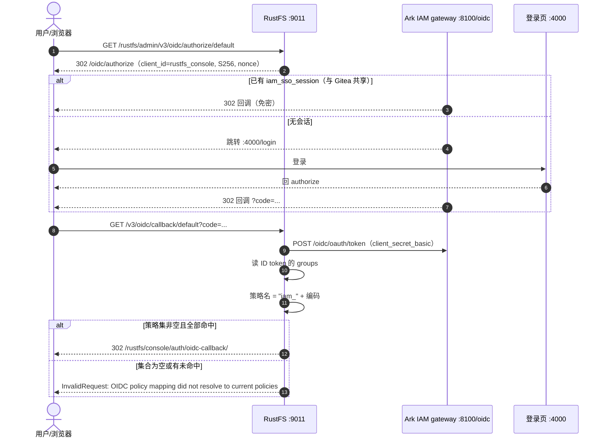

# RustFS 接入 Ark IAM OIDC 统一登录设计

日期：2026-09-18

## 背景

`docker-compose-dev/rustfs/` 已有可运行的 RustFS 单节点部署（见
[2026-09-17-rustfs-compose-design.md](2026-09-17-rustfs-compose-design.md)，其中的
`local_net` + 端口映射方案已被本设计取代）。本次要把 RustFS 控制台登录收口到 Ark IAM，
与 `gitea/` 共享同一 SSO 会话域，并让 Ark IAM 的角色授权决定用户在存储侧的权限。

两侧能力已核对：

**Ark IAM 侧**（源码 `ark-iam`，当前 HEAD `refactor/model-type-hardening`）

- OIDC Provider 以 gateway 方式用 issuer `http://localhost:8100/oidc` 暴露。
- ID token 的 `groups` 声明**按应用裁剪**：只含「登录所用客户端（`application_client.app_id`）
  所属应用」下的角色编码（`feat(oidc): add app-scoped groups claim with app-owned role codes (#68)`）。
- 契约值（角色编码）的**定义权归应用方**：`application.role_template` 声明一次，开通该应用的
  租户自动物化出角色；租户侧自建角色编码恒为空串、不进入 `groups`。
- 客户端密钥只存哈希，明文仅在创建时返回一次。

**RustFS 侧**（源码 `/Users/morehao/Documents/study/storage/rustfs`，v1.0.1；本地镜像 `rustfs/rustfs:latest`）

| 事实 | 位置 |
|---|---|
| 策略名 = `claim_prefix` + `groups` 值，纯字符串拼接，**无映射表** | `crates/iam/src/oidc.rs:1508` |
| `role_policy` 与 claim 映射**互斥**：一旦设置，`groups` 只作组上下文、不再映射策略名 | `crates/iam/src/oidc.rs:1489-1492` |
| 策略解析是**硬校验**：选中集合为空、或任一条解析不到，整次登录抛 `InvalidRequest` | `rustfs/src/admin/service/federated_identity.rs:278` |
| 策略是**全局命名实体**，一条策略全租户共用 | `crates/iam/src/manager.rs:557` |
| `config_url` 为空时整组 OIDC env 被丢弃 | `crates/iam/src/oidc.rs:1815` |
| `enable` 为空 = 启用；`redirect_uri_dynamic` 为空 = **开**（危险默认） | `crates/iam/src/oidc.rs:1819`、`:1836` |
| 同名提供方 **env 组覆盖**持久化配置 | `crates/iam/src/oidc.rs:2199-2219` |
| 控制台基路径 `/rustfs/console/`，admin API `/rustfs/admin/v3/*`，OIDC 回调 `/v3/oidc/callback/{provider_id}` | `rustfs/src/admin/route_registration_test.rs:418` |
| 出站白名单环境变量 `RUSTFS_OUTBOUND_ALLOW_ORIGINS`（精确 origin，不带路径） | `crates/utils/src/egress.rs:29` |

因此**无需修改任何一方源码**，纯配置 + 数据准备。

## 目标

- RustFS 控制台登录页出现「Ark IAM」入口，用 Ark IAM 账号登录，首次即 JIT 建立会话用户。
- RustFS 与 Gitea 共用 issuer `http://localhost:8100/oidc`，浏览器登录一次即可相互免密。
- Ark IAM 的 `groups`（应用 `rustfs_local` 的角色编码 `console_admin` / `readonly`）
  经 `claim_prefix=iam_` 映射为 RustFS 策略 `iam_console_admin` / `iam_readonly`。
- 不在代码里硬编码任何密钥：`client_secret` 只存 `rustfs/.env`（已 gitignore）。

## 非目标

- 不做多 provider / 多应用命名空间（本次只用提供方 `default` + 单一应用 `rustfs_local`）。
- 不做 STS 临时凭证的程序化发放（S3 SDK 侧接入另议）。
- 不做 RustFS 分布式 / 多节点纠删码。
- 不改 Ark IAM 与 RustFS 源码。

## 决策

| 项 | 决策 | 理由 |
|----|------|------|
| 网络 | `network_mode: host`，移除 `ports` 与 `local_net` | 容器内 `localhost` 即宿主机 gateway；issuer 与登录页同源，形成真正的 loopback SSO 会话域 |
| issuer | `http://localhost:8100/oidc`（gateway） | 与 Gitea 同一 issuer；不用 LAN IP，避免代理与私网拦截 |
| 端口 | S3 API 宿主 9010，控制台宿主 9011（`RUSTFS_ADDRESS` / `RUSTFS_CONSOLE_ADDRESS`） | host 网络下直接监听，不再有映射层 |
| OAuth client | `rustfs_console`，`tokenEndpointAuthMethod=client_secret_basic`，`grantTypes=[authorization_code]` | RustFS 是机密客户端，走标准授权码 |
| PKCE | 客户端 `requirePKCE=disable` | RustFS 自行发送 `code_challenge`（S256），但无需服务端强制；置 `disable` 不影响其使用 PKCE |
| 回调 | `http://localhost:9011/rustfs/admin/v3/oidc/callback/default` | 与 RustFS 实际注册路由一致，且白名单精确匹配 |
| 登出回调 | `http://localhost:9011/rustfs/console/auth/login`（**不是根路径**） | RustFS 登出时把控制台登录页原样作为 `post_logout_redirect_uri`（`oidc.rs:839`），服务端精确匹配，填错即 `post_logout_redirect_uri invalid` |
| 动态回调 | `REDIRECT_URI_DYNAMIC=off`（显式） | 该键为空时默认**开**，必须显式关闭 |
| 权限映射 | `CLAIM_PREFIX=iam_` + `GROUPS_CLAIM=groups`，不设 `ROLE_POLICY` | 策略名可读、可运维、跨产品命名空间隔离 |
| 角色模板 | 应用 `rustfs_local` 声明 `console_admin` / `readonly` | 编码唯一定义处；租户只能授权 |
| 策略供给 | `rustfs_policy.py` + `policies/*.json`（零依赖 SigV4） | `mc` 已停止分发（`dl.min.io` 410） |
| 密钥管理 | `RUSTFS_OIDC_CLIENT_SECRET` 经 `.env` 注入，compose 用 `:?` fail-fast | 明文不入库；缺失时启动即报错而非静默无 SSO |

## 变更清单

### 1. Ark IAM 侧（控制台/API，不改配置）

| 步骤 | 内容 |
|---|---|
| 1 | 创建应用 `rustfs_local`，`roleTemplate = [{"code":"console_admin","name":"存储控制台管理员"},{"code":"readonly","name":"存储只读用户"}]` |
| 2 | 创建 OAuth 客户端 `rustfs_console`（redirect/回调/授权类型/认证方式见上表；`postLogoutRedirectURIs` 必须为控制台登录页；`defaultScopes` 含 `profile`，否则 `groups` 不产出） |
| 3 | 创建客户端密钥，明文填入 `rustfs/.env` |
| 4 | 开通 `rustfs_local` 到租户 `t_platform`（角色模板物化为该租户角色） |
| 5 | 在租户控制台把 `console_admin` / `readonly` 授权给成员 |

### 2. RustFS 侧

#### 2.1 `rustfs/docker-compose.yml`

- `network_mode: host`，移除 `ports` 与 `networks`；端口改由 `RUSTFS_ADDRESS` /
  `RUSTFS_CONSOLE_ADDRESS` 指定。
- 新增 `RUSTFS_OUTBOUND_ALLOW_ORIGINS=${ARK_IAM_ORIGIN}`（精确 origin）。
- OIDC 提供方 `default` 整组走 env：`CONFIG_URL` / `CLIENT_ID` / `CLIENT_SECRET` /
  `SCOPES` / `REDIRECT_URI` / `REDIRECT_URI_DYNAMIC=off` / `CLAIM_PREFIX=iam_` /
  `GROUPS_CLAIM=groups` / `USERNAME_CLAIM=preferred_username` / `DISPLAY_NAME`。
- `CLIENT_SECRET` 改为 `${RUSTFS_OIDC_CLIENT_SECRET:?...}`（未设置即报错）。

#### 2.2 `rustfs/.env.example` / `rustfs/.env`

`.env.example` 入库、列出全部变量；`.env` 被 `.gitignore` 忽略、填真实 secret。
废弃 `RUSTFS_API_PORT` / `RUSTFS_CONSOLE_PORT`（host 网络下已无意义）。

```
RUSTFS_ACCESS_KEY=rustfsadmin
RUSTFS_SECRET_KEY=rustfsadmin
ARK_IAM_ORIGIN=http://localhost:8100
RUSTFS_OIDC_CLIENT_SECRET=
```

#### 2.3 策略供给（首次与每次清库后）

```bash
python3 rustfs_policy.py add iam_console_admin policies/iam_console_admin.json
python3 rustfs_policy.py add iam_readonly      policies/iam_readonly.json
```

#### 2.4 新增 `rustfs/README.md`

操作手册：部署 / 访问 / Ark IAM 侧准备 / 策略供给 / 变量表 / 验证 / 排障。

## 登录时序



## 关于顺序与失败模式

RustFS 的策略解析**不是**「认不出就跳过」：`all_oidc_policies_resolved` 要求选中集合非空且
逐条命中，否则整次登录被拒。由此得到**硬顺序**：

```
供给策略（iam_console_admin / iam_readonly）
  → 声明 roleTemplate
  → 开通应用到租户
  → 给成员授权
```

任一步缺失，用户看到的都是同一条 `InvalidRequest`，**而不是**静默降权。这与 Gitea 的
fail-safe（`groups` 为空也能登录、只是非管理员）正好相反，排障时必须先看 ID token 的 `groups`。

## 登出与单点登出（SLO）

### 方向不对称

| 方向 | 机制 | RustFS | 说明 |
|---|---|---|---|
| RustFS → IdP | RP-Initiated Logout | ✅ 支持 | 控制台登出 → `/v3/oidc/logout` → IdP `end_session`（带 `id_token_hint` + `post_logout_redirect_uri`）→ 中心会话清除，Gitea 等一并失效 |
| IdP → RustFS | Back-Channel Logout | ❌ 不支持 | 源码无接收 `logout_token` 的端点；内部 `logout_token` 是自签的一次性跳转票据（`crates/iam/src/oidc.rs:1425/1446`），非规范实现 |

结论：**「在 RustFS 登出 → 全站登出」可用**；**「在别处登出 → RustFS 会话立刻失效」不可用**，
后者要等 RustFS 本地 STS 到期（1 小时，硬编码：`IDENTITY_OPENID_KEYS` 18 个键里无任何时长项）。

因此 `postLogoutRedirectURIs` 配错时，表现是**登出这一步就报错**，而不是"登出没生效" ——
排查时先看那串 `post_logout_redirect_uri invalid`。

这不是 RustFS 特例：绝大多数自托管 RP（含同项目的 Gitea）都只实现前者。
ark-iam 作为 OP **具备**背信道登出能力（`application_client.back_channel_logout_uri` +
`oidcop/logout_worker.go:112` 实际 POST），它自己的两个控制台即用此实现强一致 SLO；
RustFS / Gitea 缺的是接收端。

### 需要强一致 SLO 时的零改动路径

RustFS 无独立会话存储 —— **STS 凭证即会话**，删除 STS 账号即立即失效
（`rustfs/src/admin/handlers/idp_compat.rs:195`）。故可用现成 admin API 外部吊销：

```
POST /rustfs/admin/v3/revoke-tokens/builtin?user=<oidc_virtual_parent>&fullRevoke=true
```

- `user` = OIDC 虚拟 parent（issuer+sub 的哈希，`federation/model.rs:60`），即 session token 的 `parent` 声明。
- **provider 段填 `builtin`**：实测填 `openid` 返回 `revoked:0` —— OIDC STS 凭证落库未持久化 claims，
  `guess_user_provider` 回落为 `builtin`（`access_key_identity.rs:303`）。这一点与参数名暗示的语义相悖，
  属上游分类缺陷，接入时须以实测为准。
- 实测效果：`{"revoked":16}`，调用后该 parent 名下全部 STS 凭证当场失效。

该 API 只是**能力**：ark-iam 不会主动调用。要自动化需一个触发方（把 back-channel logout 通知
转成这次调用的极薄 shim），属新增组件，RustFS 侧仍零改动。本设计**不含**该组件。


| 风险 | 说明 | 处理 |
|------|------|------|
| 下游硬拒绝 | 策略缺一条即整次登录失败，影响面是该应用**所有已授权用户** | 严格按「策略 → 模板 → 授权」顺序；上线后用 `groups` 与实际策略逐条核对 |
| 动态回调默认开 | `REDIRECT_URI_DYNAMIC` 空值时默认 `on`，等于接受任意回调地址 | 显式写 `off` |
| OIDC env 整组丢弃 | `CONFIG_URL` 为空时整组 env 被忽略，表现为「配了却没生效」 | 整组一次配全；改后重建容器（启动读取一次） |
| host 网络副作用 | 不再加入 `local_net`，其它容器不能用 `rustfs:9010` 访问 | 本地开发可接受；确需容器互访另议 |
| 端口变更 | 从 `9010:9000` 映射改为直接监听 9010/9011 | 客户端地址不变（宿主端口相同），仅容器内地址变化 |
| 清库即清策略 | 策略存于 `./data/`，删库后需重新 `add` | README「清库重来」已注明 |
| 密钥泄露面 | client_secret 明文仅存 `.env` | `.env` 已 gitignore；泄露即重新建密钥并更新 `.env` |
| 镜像漂移 | `rustfs/rustfs:latest` 行为随上游变化 | 关键行为均已在源码中定位行号；上游改动时按行号复核 |

## 验收标准

1. `curl -s http://localhost:8100/oidc/.well-known/openid-configuration` 返回 JSON。
2. `docker ps --filter name=rustfs` 显示 `(healthy)`。
3. `curl -s http://127.0.0.1:9011/rustfs/admin/v3/oidc/providers` 返回
   `[{"provider_id":"default","display_name":"Ark IAM"}]`。
4. `python3 rustfs_policy.py list` 含 `iam_console_admin` 与 `iam_readonly`。
5. 走完 `/rustfs/admin/v3/oidc/authorize/default` → Ark IAM 登录 → 回调，**不出现** `InvalidRequest`。
6. 回调签发的会话 token 中 `groups` 与 `policy` 一致（实测：
   `groups=["console_admin","readonly"]` → `policy="iam_console_admin,iam_readonly"`）。
7. 浏览器登录 Gitea 后访问 RustFS 控制台免密（同一 `iam_sso_session`），反向亦然。
8. 从 RustFS 控制台登出 → 中心会话被清除（`iam_sso_session` 消失），随后访问 Gitea 的
   authorize 不再免密（落地登录页）——即 **RP-Initiated Logout 方向生效**。
9. 未修改 Ark IAM 与 RustFS 源码；真实 `client_secret` 未入库。
10. 旧设计文档 `2026-09-17-rustfs-compose-design.md` 已标注被本设计取代。

## 产出物

- 修改：`rustfs/docker-compose.yml`、`rustfs/.env.example`、`docs/superpowers/specs/2026-09-17-rustfs-compose-design.md`（标注取代）
- 新增：`rustfs/README.md`、`rustfs/.env`（gitignored）、本设计文档
- 手动（本文档提供步骤）：Ark IAM 侧创建应用/客户端/密钥、开通应用、授权成员；RustFS 侧供给两条策略
